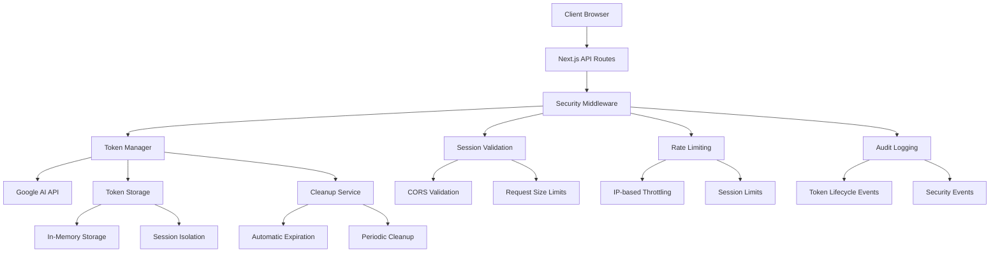
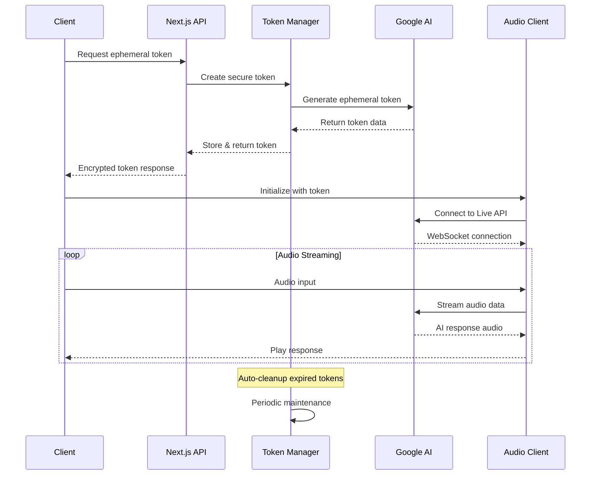

# 🎤 Gemini Live with Ephemeral Tokens

A secure, production-ready Next.js application that demonstrates real-time audio conversation with Google's Gemini AI using ephemeral token authentication. Built with modern web technologies and enterprise-grade security practices.


## ✨ Features

### 🔐 Security & Authentication
- **Ephemeral Token Management** - Secure, time-limited tokens with configurable usage limits
- **Session-based Security** - Per-session token isolation and automatic cleanup
- **Audit Logging** - Comprehensive token lifecycle tracking
- **Rate Limiting** - Built-in protection against token abuse

### 🎙️ Audio & Communication
- **Real-time Voice Chat** - Seamless bidirectional audio with Gemini AI
- **Audio Streaming** - Low-latency audio processing with Web Audio API
- **Volume Monitoring** - Real-time audio level visualization
- **Screen Capture** - Optional screen sharing capabilities

### 🎨 User Interface
- **Modern Design** - Beautiful UI built with Tailwind CSS and Radix UI
- **Dark/Light Mode** - Automatic theme switching support
- **Responsive Layout** - Mobile-first design that works everywhere
- **Real-time Status** - Live connection and token status indicators

### 🛠️ Developer Experience
- **TypeScript** - Full type safety throughout the application
- **Component Library** - Extensive UI component collection
- **Hot Reload** - Instant development feedback with Turbopack
- **Error Boundaries** - Graceful error handling and recovery

## 🚀 Quick Start

### Prerequisites

- Node.js 18+ 
- npm, yarn, pnpm, or bun
- Google AI Studio API key ([Get one here](https://aistudio.google.com/app/apikey))

### Installation

1. **Clone the repository**
   ```bash
   git clone https://github.com/greendesertsnow/gemini-live-with-ephemeral-tokens.git
   cd gemini-live-with-ephemeral-tokens
   ```

2. **Install dependencies**
   ```bash
   npm install
   # or
   yarn install
   # or
   pnpm install
   ```

3. **Set up environment variables**
   ```bash
   cp .env.example .env.local
   ```
   
   Add your Google AI API key:
   ```env
   GOOGLE_AI_API_KEY=your_api_key_here
   ```

4. **Start the development server**
   ```bash
   npm run dev
   ```

5. **Open your browser**
   Navigate to [http://localhost:3000](http://localhost:3000)

## 💰 Cost Analysis

### Gemini Live API Pricing

The Gemini Live API uses token-based pricing:
- **Input tokens**: Charged based on the number of input tokens processed
- **Output tokens**: Charged based on the number of output tokens generated
- **Total cost**: Input tokens × input rate + Output tokens × output rate

Pricing varies by model and region. Check the [Google AI pricing page](https://ai.google.dev/pricing) for current rates.

### Cost Optimization Tips

- **Short Sessions**: Limit conversation length to reduce audio processing costs
- **Token Reuse**: Configure appropriate token expiration and usage limits
- **Efficient Prompts**: Use concise prompts to minimize text generation costs
- **Session Cleanup**: Automatic cleanup prevents resource waste

## 🏗️ Architecture

### Project Structure

```
gemini-live-nextjs/
├── 📁 app/                          # Next.js App Router
│   ├── api/auth/                    # Authentication endpoints
│   │   ├── ephemeral-token/         # Token creation
│   │   ├── refresh-token/           # Token refresh
│   │   └── session-status/          # Session management
│   ├── api/weather/                 # Tool calling example
│   ├── globals.css                  # Global styles
│   ├── layout.tsx                   # Root layout
│   └── page.tsx                     # Main page
│
├── 📁 components/                   # React components
│   ├── ui/                          # Radix UI components
│   ├── dev/                         # Development tools
│   ├── live-console.tsx             # Main interface
│   ├── control-tray.tsx             # Audio controls
│   ├── side-panel.tsx               # Chat history
│   └── altair.tsx                   # Conversation display
│
├── 📁 contexts/                     # React contexts
│   ├── ephemeral-live-api-context.tsx  # Enhanced API context
│   ├── live-api-context.tsx         # Legacy API context
│   └── token-context.tsx            # Token state management
│
├── 📁 hooks/                        # Custom React hooks
│   ├── use-ephemeral-auth.ts        # Ephemeral authentication
│   ├── use-live-api.ts              # Google GenAI integration
│   ├── use-media-stream-mux.ts      # Media stream management
│   └── use-webcam.ts                # Camera access
│
├── 📁 lib/                          # Core libraries
│   ├── auth/                        # Authentication system
│   │   ├── ephemeral-token-manager.ts   # Token lifecycle
│   │   ├── secure-token-service.ts     # Token validation
│   │   ├── security-middleware.ts      # Request security
│   │   └── token-storage.ts             # Session storage
│   ├── config/                      # Configuration
│   │   └── ephemeral-token-config.ts    # Token settings
│   ├── monitoring/                  # Monitoring & debugging
│   │   ├── error-handler.ts             # Error management
│   │   └── token-monitor.ts             # Token tracking
│   ├── worklets/                    # Audio processing
│   │   ├── audio-processing.ts          # Audio worklets
│   │   └── vol-meter.ts                 # Volume monitoring
│   ├── enhanced-genai-live-client.ts   # Extended GenAI client
│   ├── audio-recorder.ts               # Audio capture
│   ├── audio-streamer.ts               # Audio streaming
│   └── types.ts                         # TypeScript definitions
│
└── 📁 certificates/                 # HTTPS certificates (development)
    ├── localhost.pem
    └── localhost-key.pem
```

### Core Components

#### 🎛️ Token Management Layer
- **EphemeralTokenManager** (`lib/auth/ephemeral-token-manager.ts`) - Complete token lifecycle management
- **SecureTokenService** (`lib/auth/secure-token-service.ts`) - Server-side token validation and security
- **TokenStorage** (`lib/auth/token-storage.ts`) - Session-based secure storage with cleanup
- **SecurityMiddleware** (`lib/auth/security-middleware.ts`) - Request validation and rate limiting

#### 🎙️ Audio Processing Pipeline
- **AudioRecorder** (`lib/audio-recorder.ts`) - Real-time audio capture with Web Audio API
- **AudioStreamer** (`lib/audio-streamer.ts`) - Bidirectional audio streaming optimization
- **VolumeMeter** (`lib/worklets/vol-meter.ts`) - Real-time audio level monitoring
- **AudioWorklets** (`lib/worklets/audio-processing.ts`) - Low-latency audio processing

#### 🔌 API Integration Framework
- **EnhancedGenAIClient** (`lib/enhanced-genai-live-client.ts`) - Extended Google GenAI Live API wrapper
- **EphemeralLiveAPIContext** (`contexts/ephemeral-live-api-context.tsx`) - React context with token management
- **TokenContext** (`contexts/token-context.tsx`) - Global token state management
- **MediaStreamMux** (`hooks/use-media-stream-mux.ts`) - Multi-stream audio/video management

#### 🎨 User Interface Components
- **LiveConsole** (`components/live-console.tsx`) - Main conversation interface with status monitoring
- **ControlTray** (`components/control-tray.tsx`) - Audio controls and settings panel
- **SidePanel** (`components/side-panel.tsx`) - Chat history and conversation management
- **TokenDashboard** (`components/dev/token-dashboard.tsx`) - Development monitoring tools

### Security Architecture



### Data Flow Architecture



## 🔧 Configuration

### Environment Variables

```env
# Required
GOOGLE_AI_API_KEY=your_api_key_here

# Optional
NODE_ENV=development
NEXT_PUBLIC_APP_ENV=development

# Model Configuration
NEXT_PUBLIC_GEMINI_MODEL=models/gemini-2.0-flash-exp  # or models/gemini-1.5-pro, models/gemini-1.5-flash

# Token Configuration
TOKEN_EXPIRATION_MINUTES=30
TOKEN_MAX_USES=1
MAX_TOKENS_PER_SESSION=3
CLEANUP_INTERVAL_MINUTES=5

# Security
ENABLE_AUDIT_LOG=true
RATE_LIMIT_WINDOW=3600000
RATE_LIMIT_MAX_REQUESTS=100
```

### Token Manager Options

```typescript
const config: TokenManagerConfig = {
  maxTokensPerSession: 3,        // Maximum concurrent tokens
  defaultExpirationMinutes: 30,  // Token lifetime
  defaultUses: 1,                // Uses per token
  cleanupIntervalMinutes: 5,     // Cleanup frequency
  enableAuditLog: true          // Audit trail
};
```

## 📚 API Reference

### Authentication Endpoints

#### `POST /api/auth/ephemeral-token`
Create a new ephemeral token with configurable expiration and usage limits.

**Request Body:**
```typescript
interface CreateTokenRequest {
  uses?: number;              // 1-5 (default: 1)
  expirationMinutes?: number; // 1-30 (default: 30)
  sessionId?: string;         // Auto-generated if not provided
  scope?: string[];           // Default: ['gemini-live-api']
}
```

**Response:**
```typescript
interface CreateTokenResponse {
  token: string;              // Ephemeral token for API access
  expiresAt: string;          // ISO 8601 expiration timestamp
  usesRemaining: number;      // Number of uses left
  sessionId: string;          // Session identifier
  scope: string[];            // Token permissions scope
}
```

**Error Responses:**
- `400 Bad Request` - Invalid parameters or session limit exceeded
- `429 Too Many Requests` - Rate limit exceeded
- `500 Internal Server Error` - Token creation failed

#### `POST /api/auth/refresh-token`
Refresh an existing session token or create a new one for the session.

**Request Body:**
```typescript
interface RefreshTokenRequest {
  sessionId: string;          // Required: existing session ID
  uses?: number;              // Optional: new usage limit
  expirationMinutes?: number; // Optional: new expiration time
}
```

**Response:**
```typescript
interface RefreshTokenResponse {
  token: string;
  expiresAt: string;
  usesRemaining: number;
  sessionId: string;
  refreshed: boolean;         // True if existing token was refreshed
}
```

#### `GET /api/auth/session-status`
Retrieve current session status and token information.

**Query Parameters:**
- `sessionId?: string` - Optional session ID filter

**Response:**
```typescript
interface SessionStatusResponse {
  sessionId: string;
  activeTokens: number;       // Currently valid tokens
  totalTokens: number;        // Total tokens created this session
  lastActivity?: Date;        // Last token usage timestamp
  nextCleanup?: Date;         // Next scheduled cleanup
  usageStats: {
    totalUses: number;
    remainingUses: number;
    averageTokenLifetime: number; // In minutes
  };
}
```

### Tool Integration Endpoints

#### `GET /api/weather`
Example tool endpoint for weather data integration.

**Query Parameters:**
- `location: string` - Location for weather data
- `units?: string` - Temperature units (celsius/fahrenheit)

**Response:**
```typescript
interface WeatherResponse {
  location: string;
  temperature: number;
  conditions: string;
  humidity: number;
  windSpeed: number;
  timestamp: string;
}
```

### WebSocket Events

The enhanced GenAI Live client emits the following events:

#### Token Management Events
```typescript
// Token refresh completed
client.on('tokenrefresh', (newToken: string, expiresAt: Date) => {
  console.log('Token refreshed:', { newToken, expiresAt });
});

// Token expired
client.on('tokenexpired', (sessionId: string) => {
  console.warn('Token expired for session:', sessionId);
});

// Reconnection attempt
client.on('reconnecting', (attempt: number, maxAttempts: number) => {
  console.log(`Reconnecting... (${attempt}/${maxAttempts})`);
});

// Successfully reconnected
client.on('reconnected', () => {
  console.log('Connection restored');
});
```

#### Audio Events
```typescript
// Audio data received
client.on('audio', (data: ArrayBuffer) => {
  // Handle incoming audio data
});

// Volume level updates
client.on('volume', (level: number) => {
  // Update volume visualization
});
```

#### Connection Events
```typescript
// Connection established
client.on('open', () => {
  console.log('Connected to Gemini Live API');
});

// Connection closed
client.on('close', (event: CloseEvent) => {
  console.log('Connection closed:', event.code, event.reason);
});

// Error occurred
client.on('error', (error: ErrorEvent) => {
  console.error('Connection error:', error);
});
```

### React Hooks

#### `useEphemeralAuth`
Comprehensive hook for managing ephemeral token authentication.

```typescript
interface UseEphemeralAuthOptions {
  autoConnect?: boolean;      // Auto-connect on mount (default: true)
  autoRefresh?: boolean;      // Auto-refresh before expiration (default: true)
  model?: string;             // Gemini model to use
  connectConfig?: LiveConnectConfig; // Additional connection options
  onTokenRefresh?: (token: string, expiresAt: Date) => void;
  onTokenExpired?: (sessionId: string) => void;
  onConnectionChange?: (status: string) => void;
  onError?: (error: Error) => void;
}

const {
  // State
  state: {
    token,                    // Current ephemeral token
    sessionId,               // Current session ID
    isLoading,               // Loading state
    isConnecting,            // Connection in progress
    isConnected,             // Connected to API
    isAuthenticated,         // Has valid token
    connectionStatus,        // Connection status string
    error,                   // Current error
    usesRemaining,           // Token uses left
    expiresAt,               // Token expiration
    needsRefresh,            // Token needs refresh
  },
  
  // Actions
  actions: {
    connect,                 // Manual connection
    disconnect,              // Disconnect from API
    refreshToken,            // Force token refresh
    revokeSession,           // Revoke current session
    retry,                   // Retry failed connection
    clearError,              // Clear error state
  },
  
  // Client instance
  client,                    // Enhanced GenAI Live client
} = useEphemeralAuth(options);
```

#### `useLiveAPI`
Legacy hook for direct Google GenAI Live API integration.

```typescript
const {
  client,                    // GenAI Live client instance
  connected,                 // Connection status
  volume,                    // Current audio volume
  config,                    // Current configuration
  model,                     // Current model
  
  // Actions
  connect,                   // Connect to API
  disconnect,                // Disconnect from API
  setConfig,                 // Update configuration
  setModel,                  // Change model
} = useLiveAPI();
```

#### `useMediaStreamMux`
Manage multiple media streams (audio/video).

```typescript
const {
  streams,                   // Active media streams
  activeStream,              // Currently active stream
  addStream,                 // Add new stream
  removeStream,              // Remove stream
  setActiveStream,           // Switch active stream
  muteAudio,                 // Mute audio
  muteVideo,                 // Mute video
} = useMediaStreamMux();
```

#### `useWebcam`
Webcam access and management.

```typescript
const {
  stream,                    // Camera stream
  isActive,                  // Camera is active
  error,                     // Camera error
  start,                     // Start camera
  stop,                      // Stop camera
  switchCamera,              // Switch between cameras
  devices,                   // Available camera devices
} = useWebcam({
  audio?: boolean,           // Include audio
  video?: MediaTrackConstraints, // Video constraints
});
```

#### `useScreenCapture`
Screen sharing functionality.

```typescript
const {
  stream,                    // Screen share stream
  isSharing,                 // Currently sharing
  error,                     // Capture error
  startCapture,              // Start screen sharing
  stopCapture,               // Stop screen sharing
  captureOptions,            // Available capture options
} = useScreenCapture();
```

## 🧪 Development

### Available Scripts

```bash
# Development
npm run dev          # Start development server with Turbopack
npm run dev:https    # Start with HTTPS (requires certificates)
npm run dev:debug    # Start with debug logging enabled

# Building
npm run build        # Build for production
npm run build:analyze # Build with bundle analyzer
npm run export       # Export static site

# Production
npm run start        # Start production server
npm run start:prod   # Start with production optimizations

# Code Quality
npm run lint         # Run ESLint
npm run lint:fix     # Fix ESLint issues automatically
npm run type-check   # Run TypeScript compiler
npm run format       # Format code with Prettier

# Testing
npm run test         # Run unit tests
npm run test:watch   # Run tests in watch mode
npm run test:e2e     # Run end-to-end tests
npm run test:coverage # Generate coverage report

# Utilities
npm run clean        # Clean build artifacts
npm run deps:check   # Check for dependency updates
npm run deps:update  # Update dependencies
```

### Development Environment Setup

#### HTTPS Development (Optional)
For testing with HTTPS locally:

1. **Generate certificates:**
   ```bash
   mkdir -p certificates
   openssl req -x509 -newkey rsa:4096 -keyout certificates/localhost-key.pem -out certificates/localhost.pem -days 365 -nodes -subj '/CN=localhost'
   ```

2. **Start HTTPS server:**
   ```bash
   npm run dev:https
   ```

3. **Access at:** `https://localhost:3000`

#### Environment Configuration
```bash
# Copy environment template
cp .env.example .env.local

# Configure required variables
echo "GEMINI_API_KEY=your_api_key_here" >> .env.local
echo "NODE_ENV=development" >> .env.local
```

### Development Tools

#### Token Dashboard
Access the comprehensive token dashboard at `/dev/tokens` featuring:

- **Real-time Monitoring:**
  - Active token status
  - Session health metrics
  - Connection state tracking
  - Usage statistics

- **Session Management:**
  - Create/refresh tokens manually
  - Revoke active sessions
  - Adjust token parameters
  - Session cleanup controls

- **Audit & Logging:**
  - Token lifecycle events
  - Security audit trail
  - Performance metrics
  - Error tracking

- **Development Controls:**
  - Mock token generation
  - Bypass validation (dev only)
  - Debug mode toggles
  - Configuration overrides

#### Browser DevTools Integration
```typescript
// Enable development tools in browser console
if (process.env.NODE_ENV === 'development') {
  window.tokenMonitor = {
    getActiveTokens: () => /* token data */,
    getSessionStats: () => /* session stats */,
    forceRefresh: () => /* refresh tokens */,
    clearSessions: () => /* cleanup */,
  };
}
```

### Code Organization

#### Component Architecture
```typescript
// Example component structure
components/
├── ui/                    # Reusable UI components (Radix)
├── feature/               # Feature-specific components
│   ├── ComponentName.tsx
│   ├── ComponentName.test.tsx
│   └── ComponentName.stories.tsx
└── dev/                   # Development-only components
```

#### Hook Patterns
```typescript
// Custom hook structure
hooks/
├── use-feature-name.ts    # Main hook implementation
├── use-feature-name.test.ts # Hook tests
└── types.ts               # Hook-specific types
```

### Testing Strategy

#### Unit Testing
```bash
# Run specific test suites
npm run test -- --testPathPattern=auth
npm run test -- --testPathPattern=components
npm run test -- --testPathPattern=hooks

# Run with coverage
npm run test:coverage

# Watch mode for development
npm run test:watch
```

#### Integration Testing
```bash
# Test API endpoints
npm run test:api

# Test component integration
npm run test:integration

# Test audio processing
npm run test:audio
```

#### End-to-End Testing
```bash
# Full application flow
npm run test:e2e

# Specific user journeys
npm run test:e2e -- --spec="auth-flow"
npm run test:e2e -- --spec="audio-conversation"
```

### Performance Monitoring

#### Bundle Analysis
```bash
# Analyze bundle size
npm run build:analyze

# Check for duplicate dependencies
npm run deps:check

# Performance profiling
npm run profile
```

#### Development Metrics
- **Token Performance:** Response times, refresh rates, error rates
- **Audio Quality:** Latency measurements, dropout detection
- **Connection Health:** WebSocket stability, reconnection success
- **Memory Usage:** Client-side memory consumption monitoring

## 🔍 Monitoring & Debugging

### Token Lifecycle Tracking

The application provides comprehensive audit logging:

```typescript
// Example audit events
TOKEN_CREATED     // New token generated
TOKEN_USED        // Token consumption
TOKEN_REFRESHED   // Session token refresh
SESSION_REVOKED   // Session termination
CLEANUP_COMPLETED // Automatic cleanup
```

### Error Handling

Common error scenarios and solutions:

| Error | Cause | Solution |
|-------|-------|----------|
| `Token not found` | Invalid/expired token | Refresh session |
| `Usage exhausted` | Token uses depleted | Create new token |
| `Session limit exceeded` | Too many active tokens | Clean up old tokens |
| `API rate limit` | Too many requests | Implement backoff |

## 🚀 Deployment

### Vercel (Recommended)

[](https://vercel.com/new/clone?repository-url=https://github.com/greendesertsnow/gemini-live-with-ephemeral-tokens)

1. Connect your GitHub repository to Vercel
2. Add environment variables in Vercel dashboard
3. Deploy automatically on push to main branch

### Docker

```dockerfile
FROM node:18-alpine
WORKDIR /app
COPY package*.json ./
RUN npm ci --only=production
COPY . .
RUN npm run build
EXPOSE 3000
CMD ["npm", "start"]
```

### Manual Deployment

```bash
npm run build
npm run start
```

## 📋 Best Practices

### Security Guidelines

- **Never expose API keys** in client-side code
- **Validate all inputs** on the server side
- **Implement rate limiting** for all endpoints
- **Use HTTPS** in production environments
- **Monitor token usage** patterns for anomalies

### Performance Optimization

- **Minimize audio latency** with efficient streaming
- **Implement connection pooling** for API requests
- **Use CDN** for static assets
- **Enable caching** for non-sensitive data
- **Monitor bundle size** and optimize imports

### Code Quality

- **Follow TypeScript strict mode** for type safety
- **Use ESLint and Prettier** for consistent formatting
- **Write comprehensive tests** for critical paths
- **Document complex logic** with clear comments
- **Regular dependency updates** for security

## 🤝 Contributing

We welcome contributions! Please see our [Contributing Guide](CONTRIBUTING.md) for details.

### Development Setup

1. Fork the repository
2. Create a feature branch: `git checkout -b feature/amazing-feature`
3. Commit changes: `git commit -m 'Add amazing feature'`
4. Push to branch: `git push origin feature/amazing-feature`
5. Open a Pull Request

## 📄 License

This project is licensed under the MIT License - see the [LICENSE](LICENSE) file for details.

## 🙏 Acknowledgments

- [Google Gemini AI](https://ai.google.dev/) for the powerful Live API
- [Next.js](https://nextjs.org/) for the excellent React framework
- [Radix UI](https://www.radix-ui.com/) for accessible UI components
- [Tailwind CSS](https://tailwindcss.com/) for utility-first styling

## 📞 Support

- **Documentation**: [Wiki](https://github.com/greendesertsnow/gemini-live-with-ephemeral-tokens/wiki)
- **Issues**: [GitHub Issues](https://github.com/greendesertsnow/gemini-live-with-ephemeral-tokens/issues)
- **Discussions**: [GitHub Discussions](https://github.com/greendesertsnow/gemini-live-with-ephemeral-tokens/discussions)

---

<div align="center">

**[⭐ Star this repo](https://github.com/greendesertsnow/gemini-live-with-ephemeral-tokens)** if you find it helpful!

Made with ❤️ by [greendesertsnow](https://github.com/greendesertsnow)

</div>
