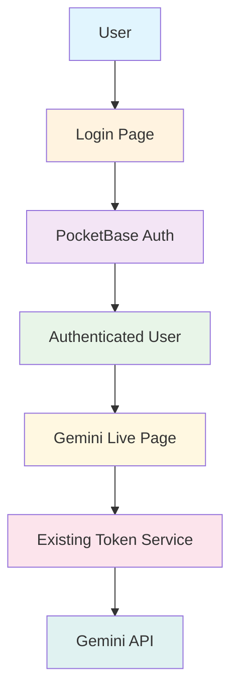
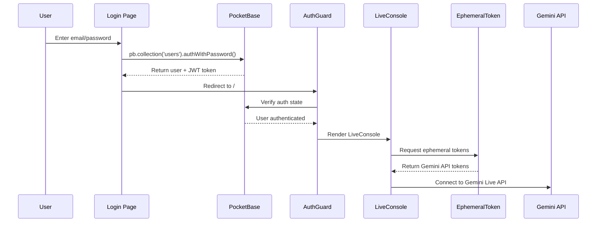

# PocketBase Authentication Implementation Guide

## Overview

This document outlines the implementation plan for integrating PocketBase email/password authentication into the Gemini Live Next.js application. The implementation preserves the existing sophisticated ephemeral token system while adding a robust user authentication layer.

## Architecture Strategy



### Current Architecture Analysis

**Existing Components:**
- **Token Management**: [`SecureTokenService`](../lib/auth/secure-token-service.ts) with ephemeral token creation
- **Auth Hooks**: [`useEphemeralAuth`](../hooks/use-ephemeral-auth.ts) for Gemini API access
- **Security**: Advanced middleware with rate limiting and CORS protection
- **UI Components**: Complete shadcn/ui library with proper TypeScript types
- **Entry Point**: [`app/page.tsx`](../app/page.tsx) directly renders [`LiveConsole`](../components/live-console.tsx)

## Implementation Plan

### Phase 1: Core Setup and Configuration

#### Environment Variables
Add to `.env.local`:
```bash
# PocketBase Configuration
NEXT_PUBLIC_POCKETBASE_URL=http://localhost:8090
```

#### Dependencies
```bash
npm install pocketbase
```

### Phase 2: PocketBase Client Setup

#### File: `lib/auth/pocketbase-client.ts`
```typescript
import PocketBase from 'pocketbase';

export const pb = new PocketBase(process.env.NEXT_PUBLIC_POCKETBASE_URL);

// Auto-refresh auth state
pb.authStore.onChange((token, model) => {
  console.log('PocketBase auth state changed:', { 
    token: !!token, 
    user: model?.email 
  });
});

export interface AuthUser {
  id: string;
  email: string;
  name?: string;
  avatar?: string;
  verified?: boolean;
}

// Auth utilities
export const authHelpers = {
  isAuthenticated: () => pb.authStore.isValid,
  getCurrentUser: () => pb.authStore.model as AuthUser | null,
  getToken: () => pb.authStore.token,
  
  async login(email: string, password: string): Promise<AuthUser> {
    const authData = await pb.collection('users').authWithPassword(email, password);
    return authData.record as AuthUser;
  },
  
  logout() {
    pb.authStore.clear();
  }
};
```

### Phase 3: Authentication Context and Hooks

#### File: `lib/auth/pocketbase-context.tsx`
```typescript
'use client';

import React, { createContext, useContext, useEffect, useState, ReactNode } from 'react';
import { pb, authHelpers, AuthUser } from './pocketbase-client';

interface PocketBaseAuthContextType {
  user: AuthUser | null;
  login: (email: string, password: string) => Promise<void>;
  logout: () => Promise<void>;
  isLoading: boolean;
  isAuthenticated: boolean;
}

const PocketBaseAuthContext = createContext<PocketBaseAuthContextType | undefined>(undefined);

export function PocketBaseAuthProvider({ children }: { children: ReactNode }) {
  const [user, setUser] = useState<AuthUser | null>(null);
  const [isLoading, setIsLoading] = useState(true);

  useEffect(() => {
    // Initialize auth state from stored token
    setUser(authHelpers.getCurrentUser());
    setIsLoading(false);

    // Listen for auth changes
    const unsubscribe = pb.authStore.onChange(() => {
      setUser(authHelpers.getCurrentUser());
    });

    return unsubscribe;
  }, []);

  const login = async (email: string, password: string) => {
    setIsLoading(true);
    try {
      const userData = await authHelpers.login(email, password);
      setUser(userData);
    } catch (error) {
      console.error('Login failed:', error);
      throw error;
    } finally {
      setIsLoading(false);
    }
  };

  const logout = async () => {
    authHelpers.logout();
    setUser(null);
  };

  const value = {
    user,
    login,
    logout,
    isLoading,
    isAuthenticated: !!user && authHelpers.isAuthenticated()
  };

  return (
    <PocketBaseAuthContext.Provider value={value}>
      {children}
    </PocketBaseAuthContext.Provider>
  );
}

export function usePocketBaseAuth() {
  const context = useContext(PocketBaseAuthContext);
  if (context === undefined) {
    throw new Error('usePocketBaseAuth must be used within a PocketBaseAuthProvider');
  }
  return context;
}
```

#### File: `lib/auth/auth-hooks.ts`
```typescript
import { useRouter } from 'next/navigation';
import { usePocketBaseAuth } from './pocketbase-context';

export function useAuthRedirect() {
  const router = useRouter();
  const { isAuthenticated, isLoading } = usePocketBaseAuth();

  const redirectToLogin = () => {
    router.push('/login');
  };

  const redirectToHome = () => {
    router.push('/');
  };

  return {
    isAuthenticated,
    isLoading,
    redirectToLogin,
    redirectToHome
  };
}
```

### Phase 4: Authentication Guard Components

#### File: `lib/auth/auth-guard.tsx`
```typescript
'use client';

import { useEffect } from 'react';
import { useAuthRedirect } from './auth-hooks';

interface AuthGuardProps {
  children: React.ReactNode;
  fallback?: React.ReactNode;
}

export function AuthGuard({ children, fallback }: AuthGuardProps) {
  const { isAuthenticated, isLoading, redirectToLogin } = useAuthRedirect();

  useEffect(() => {
    if (!isLoading && !isAuthenticated) {
      redirectToLogin();
    }
  }, [isLoading, isAuthenticated, redirectToLogin]);

  if (isLoading) {
    return fallback || (
      <div className="min-h-screen bg-background flex items-center justify-center">
        <div className="text-center">
          <h1 className="text-2xl font-bold mb-4">Authenticating...</h1>
          <p className="text-muted-foreground">
            Verifying your credentials...
          </p>
        </div>
      </div>
    );
  }

  if (!isAuthenticated) {
    return null; // Will redirect to login
  }

  return <>{children}</>;
}
```

### Phase 5: Login Form Implementation

#### File: `components/auth/login-form.tsx`
```typescript
'use client';

import { cn } from "@/lib/utils";
import { Button } from "@/components/ui/button";
import {
  Card,
  CardContent,
  CardDescription,
  CardHeader,
  CardTitle,
} from "@/components/ui/card";
import { Input } from "@/components/ui/input";
import { Label } from "@/components/ui/label";
import { useState } from "react";
import { usePocketBaseAuth } from "@/lib/auth/pocketbase-context";
import { useAuthRedirect } from "@/lib/auth/auth-hooks";

export function LoginForm({
  className,
  ...props
}: React.ComponentProps<"div">) {
  const [email, setEmail] = useState("");
  const [password, setPassword] = useState("");
  const [error, setError] = useState("");
  
  const { login, isLoading } = usePocketBaseAuth();
  const { redirectToHome } = useAuthRedirect();

  const handleSubmit = async (e: React.FormEvent) => {
    e.preventDefault();
    setError("");
    
    try {
      await login(email, password);
      redirectToHome();
    } catch (error: any) {
      console.error('Login failed:', error);
      setError(error?.message || 'Login failed. Please check your credentials.');
    }
  };

  return (
    <div className={cn("flex flex-col gap-6", className)} {...props}>
      <Card>
        <CardHeader>
          <CardTitle>Login to Gemini Live</CardTitle>
          <CardDescription>
            Enter your email and password to access the Gemini Live console
          </CardDescription>
        </CardHeader>
        <CardContent>
          <form onSubmit={handleSubmit}>
            <div className="flex flex-col gap-6">
              {error && (
                <div className="text-sm text-destructive bg-destructive/10 p-3 rounded-md">
                  {error}
                </div>
              )}
              
              <div className="grid gap-3">
                <Label htmlFor="email">Email</Label>
                <Input
                  id="email"
                  type="email"
                  placeholder="m@example.com"
                  value={email}
                  onChange={(e) => setEmail(e.target.value)}
                  required
                />
              </div>
              
              <div className="grid gap-3">
                <div className="flex items-center">
                  <Label htmlFor="password">Password</Label>
                </div>
                <Input 
                  id="password" 
                  type="password" 
                  value={password}
                  onChange={(e) => setPassword(e.target.value)}
                  required 
                />
              </div>
              
              <div className="flex flex-col gap-3">
                <Button type="submit" className="w-full" disabled={isLoading}>
                  {isLoading ? "Signing in..." : "Login"}
                </Button>
              </div>
            </div>
          </form>
        </CardContent>
      </Card>
    </div>
  );
}
```

### Phase 6: Route Setup and Protection

#### File: `app/login/page.tsx`
```typescript
import { LoginForm } from "@/components/auth/login-form";

export default function LoginPage() {
  return (
    <div className="min-h-screen flex items-center justify-center bg-background">
      <div className="w-full max-w-md">
        <LoginForm />
      </div>
    </div>
  );
}
```

#### File: `middleware.ts`
```typescript
import { NextRequest, NextResponse } from 'next/server';

export function middleware(request: NextRequest) {
  // Check for PocketBase auth cookie
  const authCookie = request.cookies.get('pb_auth');
  const isLoginPage = request.nextUrl.pathname.startsWith('/login');
  const isApiRoute = request.nextUrl.pathname.startsWith('/api');

  // Allow API routes and static files
  if (isApiRoute) {
    return NextResponse.next();
  }

  // If no auth cookie and not on login page, redirect to login
  if (!authCookie && !isLoginPage) {
    return NextResponse.redirect(new URL('/login', request.url));
  }

  // If authenticated and on login page, redirect to home
  if (authCookie && isLoginPage) {
    return NextResponse.redirect(new URL('/', request.url));
  }

  return NextResponse.next();
}

export const config = {
  matcher: ['/((?!_next/static|_next/image|favicon.ico).*)']
};
```

#### Modified `app/layout.tsx`
```typescript
import type { Metadata } from "next";
import { Geist, Geist_Mono } from "next/font/google";
import "./globals.css";
import { PocketBaseAuthProvider } from "@/lib/auth/pocketbase-context";

const geistSans = Geist({
  variable: "--font-geist-sans",
  subsets: ["latin"],
});

const geistMono = Geist_Mono({
  variable: "--font-geist-mono",
  subsets: ["latin"],
});

export const metadata: Metadata = {
  title: "Gemini Live API Console",
  description: "Interactive console for Google Gemini Live API with real-time audio/video streaming",
};

export default function RootLayout({
  children,
}: Readonly<{
  children: React.ReactNode;
}>) {
  return (
    <html lang="en">
      <body
        className={`${geistSans.variable} ${geistMono.variable} antialiased`}
      >
        <PocketBaseAuthProvider>
          {children}
        </PocketBaseAuthProvider>
      </body>
    </html>
  );
}
```

#### Modified `app/page.tsx`
```typescript
"use client";

import ClientOnly from "@/components/client-only";
import LiveConsole from "@/components/live-console";
import { AuthGuard } from "@/lib/auth/auth-guard";

export default function Home() {
  return (
    <AuthGuard>
      <ClientOnly
        fallback={
          <div className="min-h-screen bg-background flex items-center justify-center">
            <div className="text-center">
              <h1 className="text-2xl font-bold mb-4">Loading Gemini Live...</h1>
              <p className="text-muted-foreground">
                Initializing secure connection...
              </p>
            </div>
          </div>
        }
      >
        <LiveConsole />
      </ClientOnly>
    </AuthGuard>
  );
}
```

### Phase 7: Integration with Existing Token System

The PocketBase authentication layer integrates seamlessly with the existing token system:

1. **Session Management**: PocketBase handles user sessions via HTTP-only cookies
2. **Token Service**: Existing [`SecureTokenService`](../lib/auth/secure-token-service.ts) continues to manage Gemini API tokens
3. **Security Middleware**: Current security features remain active and protect both authentication and API routes
4. **Context Preservation**: [`TokenContext`](../contexts/token-context.tsx) and [`EphemeralLiveApiContext`](../contexts/ephemeral-live-api-context.tsx) work unchanged

## Authentication Flow



## Testing Guidelines

### Manual Testing Checklist

1. **Authentication Flow**
   - [ ] Login with valid credentials redirects to main app
   - [ ] Login with invalid credentials shows error message
   - [ ] Logout clears session and redirects to login
   - [ ] Direct access to `/` redirects to `/login` when not authenticated
   - [ ] Access to `/login` redirects to `/` when authenticated

2. **Integration Testing**
   - [ ] Gemini Live functionality works after authentication
   - [ ] Existing token management continues to function
   - [ ] Security middleware protects routes appropriately
   - [ ] Session persistence across browser restarts

3. **Error Handling**
   - [ ] Network errors during login are handled gracefully
   - [ ] PocketBase server unavailable scenarios
   - [ ] Invalid token scenarios

## Security Considerations

1. **Session Security**: PocketBase uses HTTP-only cookies for session management
2. **CORS Integration**: Works with existing [`TOKEN_ALLOWED_ORIGINS`](../.env.example) configuration
3. **Rate Limiting**: Leverages existing security middleware for login attempt limiting
4. **Token Validation**: Automatic token refresh and validation through PocketBase SDK

## Deployment Notes

### Environment Variables for Production

```bash
# PocketBase Configuration
NEXT_PUBLIC_POCKETBASE_URL=https://your-pocketbase-domain.com

# Existing Gemini Configuration (unchanged)
GEMINI_API_KEY=your_gemini_api_key_here
NEXT_PUBLIC_GEMINI_MODEL=models/gemini-2.0-flash-exp
TOKEN_ALLOWED_ORIGINS=https://your-domain.com
```

### PocketBase Setup

1. Create a `users` collection with email/password authentication
2. Configure authentication rules and validation
3. Set up proper CORS settings for your domain
4. Enable email verification if required

## File Structure Summary

```
lib/auth/
├── pocketbase-client.ts      # PocketBase client and utilities
├── pocketbase-context.tsx    # React context for auth state
├── auth-hooks.ts            # Custom authentication hooks
└── auth-guard.tsx           # Route protection component

components/auth/
└── login-form.tsx           # Enhanced login form component

app/
├── login/
│   └── page.tsx            # Login page route
├── layout.tsx              # Modified with auth provider
├── page.tsx                # Modified with auth guard
└── middleware.ts           # Route protection middleware
```

This implementation provides a robust, secure authentication system that integrates seamlessly with your existing Gemini Live application architecture.